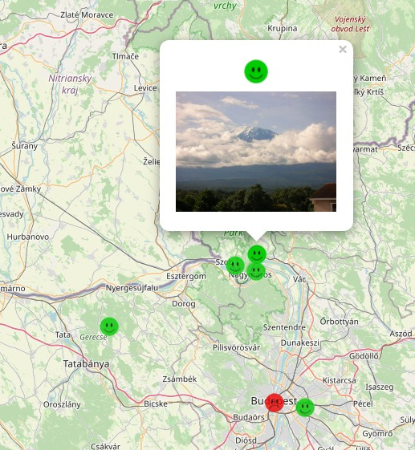

# Map Image

This is a map based web application which enables users to add images with description
at a certain location and mark their opinion / feeling about it as positive / negative.

## Preparations

### Step 1

Install [MySQL](https://www.mysql.com/), create a database and then a table to store the markers:

```
CREATE TABLE `markers` (
  `id` int NOT NULL AUTO_INCREMENT,
  `emotion` tinyint NOT NULL,
  `comment` varchar(300) NOT NULL DEFAULT '',
  `location` point NOT NULL,
  `image` longtext,
  PRIMARY KEY (`id`)
) ENGINE=InnoDB AUTO_INCREMENT=85 DEFAULT CHARSET=utf8mb4 COLLATE=utf8mb4_0900_ai_ci;
```

### Step 2

In the beginning of [backend/app.js](./backend/app.js) fill in the appropriate database parameters:

```
const db = mysql.createConnection({
    host: 'localhost',
    user: 'guest',
    password: 'guest',
    database: 'geodb'
});
```

### Step 3

Make sure you have [NodeJS](https://nodejs.org/en/) installed on your computer.

## Run the application

### Backend

The backend is a very simple [NodeJS](https://nodejs.org/en/) application.

After installing dependencies by

```
cd backend
npm install
```

run the sever by

```
nodemon
```

### Frontend

The frontend is made with [Leaflet Map](https://leafletjs.com/) and [Lit Components](https://lit.dev/).

After installing dependencies by

```
cd frontend
npm install
```

run the frontend by

```
npm start
```

Then the map application is available at `localhost:8080` in the browser.



You can add marker

- by clicking on the map with image to be uploaded from the input dialog
- by the `Add Image with GPS` button in the upper-left corner if the image contains location meta data

There is an admin page at `localhost:8080/admin.html` where you can download all markers in JSON format,
with base64 encoded images.